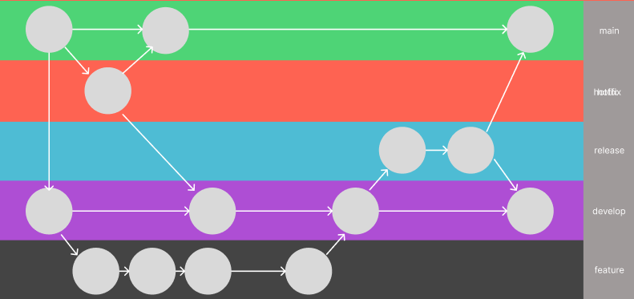

# Smoothie & Açaí Shop Online Ordering App

## Table of Contents

- [Smoothie \& Açaí Shop Online Ordering App](#smoothie--açaí-shop-online-ordering-app)
  - [Table of Contents](#table-of-contents)
  - [Project Overview](#project-overview)
    - [Tech Stack](#tech-stack)
  - [Dataflow Diagram](#dataflow-diagram)
  - [Application Architecture](#application-architecture)
    - [Presentation Layer](#presentation-layer)
    - [Business Logic Layer](#business-logic-layer)
    - [Data Access Layer](#data-access-layer)
  - [User Stories](#user-stories)
    - [Customer Perspective](#customer-perspective)
    - [Shop Owner Perspective](#shop-owner-perspective)
  - [Wireframes](#wireframes)
    - [Screenshots](#screenshots)
  - [Git Workflow Using Git Flow](#git-workflow-using-git-flow)
    - [Main Branches](#main-branches)
    - [Supporting Branches](#supporting-branches)
    - [Workflow](#workflow)
  - [Trello Board](#trello-board)
    - [Board Structure](#board-structure)

## Project Overview

The Smoothie & Açaí Shop Online Ordering App aims to enhance customer experience and streamline operations for a health-focused retail business. The app provides a user-friendly platform for customers to browse menus, customise orders, and track their orders, while offering efficient management tools for shop owners.

### Tech Stack

- **Front-end**: React.js
- **Back-end**: Node.js & Express
- **Database**: MongoDB
- **Design Tools**: Figma

## Dataflow Diagram

The Data Flow Diagram (DFD) visually represents how data moves through the application. It illustrates the interaction between users and the different layers of the system. Here's a detailed breakdown:

- **User Interaction Layer:** This is where users interact with the application via the front-end. When a user browses the menu, customizes an order, or makes a payment, these actions initiate data flow.
- **Data Input:** User actions are input to the system. For instance, when browsing the menu, the user is requesting data from the server.
- **Back-End Processing Layer:** The back-end, built with Node.js and Express, receives user requests. It processes these requests, interacts with the database, and sends responses back to the front-end. This layer handles business logic, such as calculating order totals and validating user inputs.
- **Data Storage:** The database, using MongoDB, stores all data related to the application. This includes menu items, user information, and order details. Data is read from and written to the database by the back-end.
- **Data Output:** The back-end sends processed data to the front-end. This might include displaying a menu, updating order status, or confirming a payment.
- **Data Flow:** The DFD also shows how the data flows between these layers. For example, when a customer places an order, the flow is: user input on the front-end, request to back-end, data processing and storage in the database, and confirmation back to the front-end. The specific details of this flow will be illustrated in the diagram itself.

[Insert DFD Here]

## Application Architecture

The Application Architecture Diagram (AAD) illustrates the different components of the application and how they interact. The application follows a layered architecture to ensure a separation of concerns and scalability. Here's a detailed explanation:

### Presentation Layer

This layer is the front-end of the application, built with React.js.
It handles user interface and user experience.
It is responsible for displaying information and receiving user inputs.

### Business Logic Layer

This layer is the back-end of the application, built using Node.js and Express.
It manages the core functionality of the application.
It handles data validation, processing, and interaction with the data access layer.

### Data Access Layer

- This layer manages how data is stored and retrieved from the database.
- It uses MongoDB to store the data with Mongoose as the Object Relational Mapper (ORM).
- It is responsible for handling database operations such as CRUD (Create, Read, Update, Delete).

[Insert Diagram Here]

## User Stories

Categorised by user roles, these stories highlight key functionalities.

### Customer Perspective

- As a customer, I want to browse the menu to explore available smoothies and açaí bowls.
- As a customer, I want to customise my order to include specific add-ons.
- As a customer, I want to track my order status to know when it's ready.

### Shop Owner Perspective

- As a shop owner, I want to manage menu items to update prices and descriptions.
- As a shop owner, I want to view sales reports to analyse revenue trends.

## Wireframes

Visual designs for key app screens ensure an intuitive user experience.

### Screenshots

1. **Menu Browsing**
2. **Order Customisation**
3. **Checkout Process**
4. **Order Tracking**

## Git Workflow Using Git Flow

The Git Flow workflow is used to manage source code, branching, and releases. Here's a description of the workflow:

### Main Branches

**main:** This branch contains the official release history.
**develop:** This is the main development branch from where all feature branches are branched from.

### Supporting Branches

**feature:** Feature branches are created for each new feature or task. They are branched from develop and merged back into develop after completion.
**release:** Release branches are created to prepare for a new release. They are branched from develop and merged into main and develop after release.
**hotfix:** Hotfix branches are created to fix bugs in production. They are branched from main and merged back into main and develop after the fix.

### Workflow

- New features are developed on feature branches branched from the develop branch.
- Once completed, feature branches are merged back into the develop branch.
- When ready for release, a release branch is created from the develop branch.
- After testing, the release branch is merged into the main branch, and also back into develop.
- If a bug is found in the main branch, it is addressed by creating a hotfix branch.
- After the bug is fixed, the hotfix branch is merged into main and also develop.

- **Version Control:** Git is used for version control, and all code changes are made using commits and pull requests.
- **Team Collaboration:** Git workflow provides a structured way for all team members to collaborate efficiently on the project.
- **Source Control:** This workflow ensures proper source control methodology and maintains a clean and organised project.
- **Branching Strategy:** Using a structured branching strategy like Git Flow helps manage code, facilitate collaboration, and ensure a stable and well maintained repository.

## Trello Board

Organised task management using Trello demonstrates efficient project tracking.

### Board Structure

- Lists: To Do, In Progress, Testing, Done
- Cards: Feature tasks (e.g., "Implement menu browsing")

[Insert Screenshots Here]

