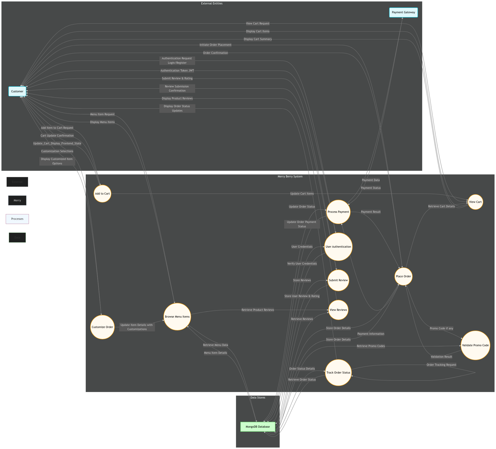

# Smoothie & Açaí Shop Online Ordering App

## Table of Contents

- [Smoothie \& Açaí Shop Online Ordering App](#smoothie--açaí-shop-online-ordering-app)
  - [Table of Contents](#table-of-contents)
  - [Project Overview](#project-overview)
    - [Tech Stack](#tech-stack)
  - [Dataflow Diagram](#dataflow-diagram)
  - [Application Architecture](#application-architecture)
    - [Presentation Layer](#presentation-layer)
    - [Business Logic Layer](#business-logic-layer)
    - [Data Access Layer](#data-access-layer)
  - [User Stories](#user-stories)
    - [Customer Perspective](#customer-perspective)
    - [Shop Owner Perspective](#shop-owner-perspective)
  - [Customer Flow](#customer-flow)
  - [Wireframes](#wireframes)
    - [Screenshots](#screenshots)
  - [Git Workflow Using Git Flow](#git-workflow-using-git-flow)
    - [Main Branches](#main-branches)
    - [Supporting Branches](#supporting-branches)
    - [Workflow](#workflow)
  - [Trello Board](#trello-board)
    - [Board Structure](#board-structure)

## Project Overview

The Smoothie & Açaí Shop Online Ordering App aims to enhance customer experience and streamline operations for a health-focused retail business. The app provides a user-friendly platform for customers to browse menus, customise orders, and track their orders, while offering efficient management tools for shop owners.

### Tech Stack

- **Front-end**: React.js
- **Back-end**: Node.js & Express
- **Database**: MongoDB
- **Design Tools**: Figma

## 🗺️ Dataflow Diagram: Visualizing Data Flow within the Merry Berry System

To comprehensively illustrate the flow of data within the Merry Berry Smoothie & Açaí Shop Online Ordering App, we have developed a Dataflow Diagram (DFD). This diagram adheres strictly to standard DFD conventions and provides a clear, visual representation of how data moves through our application, from user interactions to database storage and backend processing.  The DFD is essential for understanding the system's data handling processes and ensuring data integrity throughout the application lifecycle.

### 🔑 Key Components of the Dataflow Diagram

Our Dataflow Diagram explicitly identifies and depicts the following key components, adhering to standard DFD notation:

*   **External Entities:**  These represent actors or systems outside of our application that interact with it.  In our DFD, the primary External Entity is the **"Customer"**, who initiates requests and receives data from the system.  We also implicitly consider the **"Payment Gateway (Stripe)"** as an external entity for payment processing.
*   **Processes:**  Processes represent actions or transformations performed by the system on the data. Our DFD clearly identifies all critical processes within the Merry Berry application. Examples include:
    *   `Browse Menu Items`:  The process of retrieving and displaying menu information to the customer.
    *   `Customize Order`:  The process of handling user selections for order modifications (size, toppings, etc.).
    *   `Add to Cart`: The process of storing selected items in the user's shopping cart.
    *   `Process Order`: The core process encompassing order placement, validation, and storage.
    *   `Process Payment`:  The interaction with the external Payment Gateway (Stripe) to handle transactions.
    *   `Track Order Status`:  The process of updating and displaying the real-time status of an order.
    *   `Manage Menu Items (Admin)`:  (Potentially depicted if admin functionalities are within scope of the DFD) The process for shop owners to update menu information.
*   **Data Stores:** Data Stores represent where data is held or persisted within the system. Our DFD clearly indicates the primary Data Store:
    *   `MongoDB Database`:  Representing our MongoDB database, which stores menu items, user data, order information, and reviews.
*   **Data Flows:** Data Flows represent the movement of data between entities, processes, and data stores.  Our DFD meticulously labels each data flow with a descriptive name indicating the data being transferred. Examples include:
    *   `Menu Item Request`: Data flow from Customer to `Browse Menu Items` process.
    *   `Menu Item Details`: Data flow from `MongoDB Database` to `Browse Menu Items` process.
    *   `Customization Selections`: Data flow from Customer to `Customize Order` process.
    *   `Order Details`: Data flow between various processes and to the `MongoDB Database`.
    *   `Payment Information`: Data flow to and from the `Process Payment` process and `Payment Gateway (Stripe)`.
    *   `Order Status Update`: Data flow from backend processes to the Customer.

The complete Dataflow Diagram, visually representing these components and their interactions, is available as a separate image file in the [`docs/diagrams/`](./docs/diagrams/) directory, named `dataflow_diagram.png`.  This diagram provides a detailed and standards-compliant view of data movement within the Merry Berry application.

## Application Architecture

The Application Architecture Diagram (AAD) illustrates the different components of the application and how they interact. The application follows a layered architecture to ensure a separation of concerns and scalability. Here's a detailed explanation:

### Presentation Layer

This layer is the front-end of the application, built with React.js.
It handles user interface and user experience.
It is responsible for displaying information and receiving user inputs.

### Business Logic Layer

This layer is the back-end of the application, built using Node.js and Express.
It manages the core functionality of the application.
It handles data validation, processing, and interaction with the data access layer.

### Data Access Layer

- This layer manages how data is stored and retrieved from the database.
- It uses MongoDB to store the data with Mongoose as the Object Relational Mapper (ORM).
- It is responsible for handling database operations such as CRUD (Create, Read, Update, Delete).

[Insert Diagram Here]

## User Stories

Categorised by user roles, these stories highlight key functionalities.

### Customer Perspective

- As a customer, I want to browse the menu to explore available smoothies and açaí bowls.
- As a customer, I want to customise my order to include specific add-ons.
- As a customer, I want to track my order status to know when it's ready.

### Shop Owner Perspective

- As a shop owner, I want to manage menu items to update prices and descriptions.
- As a shop owner, I want to view sales reports to analyse revenue trends.

## Customer Flow

The sequence of actions taken by a customer to engage with the web application.

## Wireframes

Visual designs for key app screens ensure an intuitive user experience.

### Screenshots

1. **Menu Browsing**
2. **Order Customisation**
3. **Checkout Process**
4. **Order Tracking**

## Git Workflow Using Git Flow

The Git Flow workflow is used to manage source code, branching, and releases. Here's a description of the workflow:

### Main Branches

**main:** This branch contains the official release history.
**develop:** This is the main development branch from where all feature branches are branched from.

### Supporting Branches

**feature:** Feature branches are created for each new feature or task. They are branched from develop and merged back into develop after completion.
**release:** Release branches are created to prepare for a new release. They are branched from develop and merged into main and develop after release.
**hotfix:** Hotfix branches are created to fix bugs in production. They are branched from main and merged back into main and develop after the fix.

### Workflow

- New features are developed on feature branches branched from the develop branch.
- Once completed, feature branches are merged back into the develop branch.
- When ready for release, a release branch is created from the develop branch.
- After testing, the release branch is merged into the main branch, and also back into develop.
- If a bug is found in the main branch, it is addressed by creating a hotfix branch.
- After the bug is fixed, the hotfix branch is merged into main and also develop.

- **Version Control:** Git is used for version control, and all code changes are made using commits and pull requests.
- **Team Collaboration:** Git workflow provides a structured way for all team members to collaborate efficiently on the project.
- **Source Control:** This workflow ensures proper source control methodology and maintains a clean and organised project.
- **Branching Strategy:** Using a structured branching strategy like Git Flow helps manage code, facilitate collaboration, and ensure a stable and well maintained repository.

## Trello Board

Organised task management using Trello demonstrates efficient project tracking.

### Board Structure

- Lists: To Do, In Progress, Testing, Done
- Cards: Feature tasks (e.g., "Implement menu browsing")

[Insert Screenshots Here]
